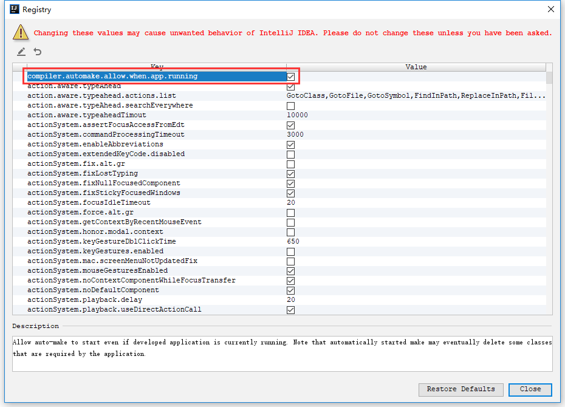

# Spring Boot 热部署
## 1.添加依赖
```xml
<dependency>
    <groupId>org.springframework.boot</groupId>
    <artifactId>spring-boot-devtools</artifactId>
    <scope>runtime</scope>
</dependency>
```
## 2.使能自动构建及自动保存
快捷键：`Control + Alt + S`


## 3.使能 AutoMake
快捷键：`Shirft + Control + Alt + /`
